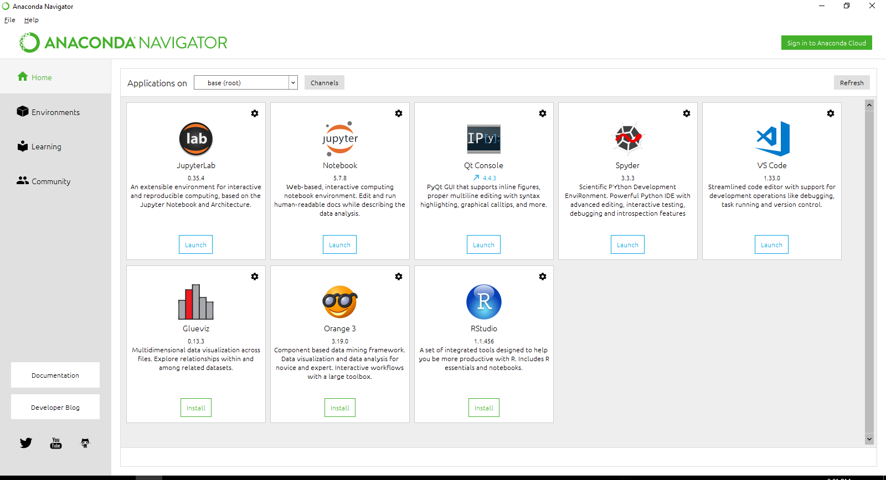
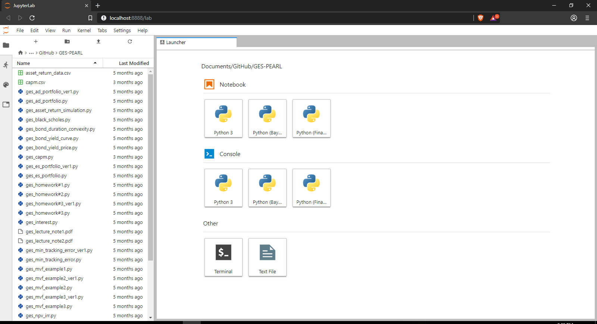

# PROBABILITY AND STATISTICS A/B: FACULTY OF ECONOMICS KEIO UNIVERSITY

## Course materials for PROBABILITY AND STATISTICS A/B

Teruo Nakatsuma (Faculty of Economics, Keio University, Japan)

---

## How to set up Python and necessary packages

I strongly recommend using [Anaconda](https://www.anaconda.com/). It can install Python along with numerous essential packages at once and allows us to manage those packages flexibly.

### Step 1: Installing Anaconda

1. If you have an older Anaconda on your PC, uninstall it completely by folloiwng [instructions](https://docs.anaconda.com/anaconda/install/uninstall/).

2. Download an Anaconda installer (Windows, macOS or Linux) from [here](https://www.anaconda.com/distribution/). Choose a Python 3 installer.

3. Doubleclick the installer and keep clicking `Continue`, `Next` or `Ok`.

### Step 2: Creating an environment

Start `Anaconda Powershell Prompt` (Windows) or `Terminal` (macOS, Linux) and type

```IPython
(base) C:\Users\Thomas> conda create -n bayes jupyterlab seaborn spyder pymc3
```

Then type

```IPython
(base) C:\Users\Thomas> conda activate bayes
```

You will notice that the prompt is altered as

```IPython
(bayes) C:\Users\Thomas>
```

Type

```IPython
(bayes) C:\Users\Thomas> conda install conda-forge::theano
```

Finally type

```IPython
(bayes) C:\Users\Thomas> python -m ipykernel install --user --name bayes --display-name "Python (Bayes)"
```

Now you are ready for Python!

---

## How to start JupyterLab

Start `Anaconda Navigator`. You may find it in `Start Menu` (Windows) or `Launchpad` (macOS). Alternatively you just type

```IPython
(base) C:\Users\Thomas> anaconda-navigator
```

in `Anaconda Powershell Prompt` (Windows) or `Terminal` (macOS, Linux).

Click the `Launch` button in the `JupyterLab` panel.



Your default browser will pop up. Click the `Python (Bayes)` button to create a Jupyter notebook.



---
